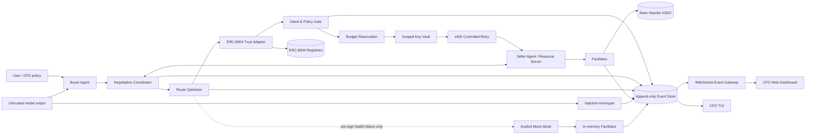
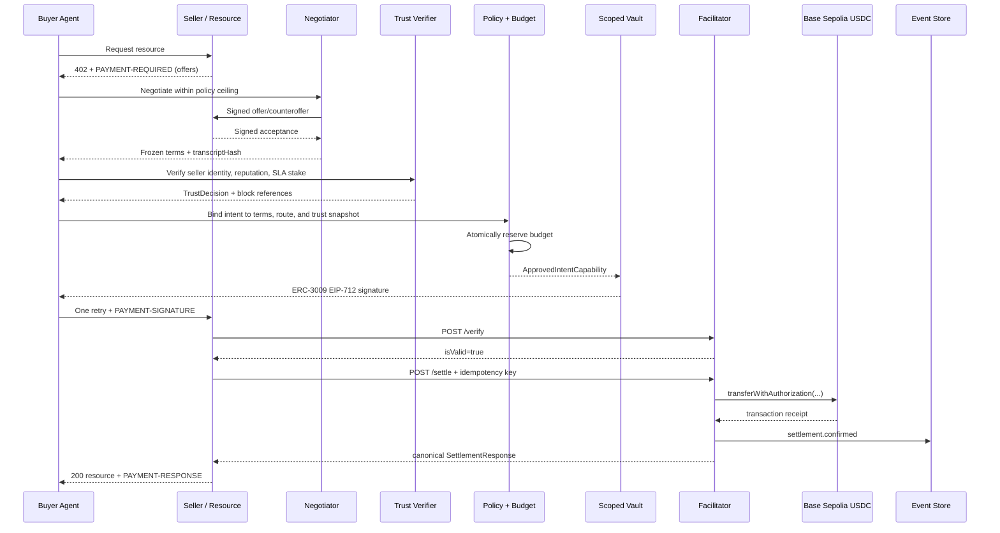

# Cathay IntentSentinel Architecture

> x402 makes agent payments possible; IntentSentinel makes them safe, verifiable, and governable.

Status: target architecture approved for the Option A+B hybrid.  
Decision date: 2026-09-04.  
Primary network: Base Sepolia (`eip155:84532`).  
Primary payment: x402 v2 `exact` using USDC ERC-3009 `transferWithAuthorization`.

## 1. Document contract and implementation status

This is the canonical technical specification for the hackathon build. It intentionally distinguishes what exists from what is proposed:

| Mark | Meaning |
| --- | --- |
| **Implemented** | Present in this repository and covered by tests. |
| **Partial** | A useful interface or simulation exists, but the end-to-end claim is not yet true. |
| **Target** | Required by this architecture but not yet implemented. |

No UI, mock transaction hash, or off-chain assertion may be presented as on-chain evidence. A feature becomes **Implemented** only after its acceptance tests in section 19 pass.

Normative words **MUST**, **MUST NOT**, **SHOULD**, and **MAY** are used as requirements.

## 2. Goals and non-goals

### Goals

1. Let an autonomous buyer obtain a paid resource through x402 without exposing an unrestricted private key to the model.
2. Bind every authorization to a trusted task, resource, payee, asset, network, amount ceiling, nonce, and expiry.
3. Make Base Sepolia settlement and ERC-8004 trust checks independently verifiable through RPC reads and explorer links.
4. Negotiate price before intent creation, then freeze the accepted commercial terms into the policy and signing boundary.
5. Continue a live presentation during RPC failure through an explicitly labeled, isolated in-memory simulation.
6. Give a CFO a real-time, tamper-evident view of cost, policy, trust, negotiation, routing, settlement, and security events.

### Non-goals

- Mainnet custody or production financial advice.
- Treating an ERC-8004 registration or raw reputation average as proof that an agent is safe.
- Bridging assets during the synchronous x402 request path.
- Allowing an LLM to approve payments, choose arbitrary contracts, or author final executable calldata.
- Automatically publishing threat reports to third parties without a configured approval and redaction policy.

## 3. System invariants

These invariants override availability and demo convenience:

1. **The model never holds or receives a private key.** It proposes structured commercial actions only.
2. **Negotiate, route, trust-check, bind, approve, reserve, sign, settle** is the only valid order.
3. A signed authorization MUST exactly match the approved intent and accepted x402 requirement.
4. Amounts are unsigned decimal strings in token atomic units; JavaScript floating point is forbidden for money.
5. The canonical network identifier is CAIP-2, for example `eip155:84532`.
6. ERC-3009 nonces are cryptographically random 32-byte values and unique per authorizer.
7. A signed-but-unresolved authorization counts against available budget until it expires or is reconciled.
8. `/verify` is read-only. Only `/settle` may claim a nonce or submit a transaction.
9. A settlement timeout is `UNKNOWN`, not failure and never permission to sign or submit again.
10. Mock fallback is allowed only before a live authorization is signed or broadcast.
11. Live and mock ledgers, idempotency namespaces, receipts, and dashboard badges MUST be visibly distinct.
12. Protected content is released only after the configured confirmation policy is satisfied.
13. Observability failure cannot change a policy decision or block settlement correctness.
14. Untrusted merchant content and prompt-injection samples never enter the trusted policy context.

## 4. Hybrid runtime overview



### Trust boundaries

| Boundary | Trusted inputs | Untrusted inputs | Required control |
| --- | --- | --- | --- |
| Buyer agent | User goal ID, policy handle | Model prose, merchant response | Schema validation and task binding |
| Negotiation | Policy price ceiling | Agent offers and counters | Signed transcript and deterministic constraints |
| Policy gate | Immutable task context, registry policy | Quote metadata, registration URI content | Fail closed; SSRF-safe metadata fetch |
| Key vault | Approved intent plus reservation | All arbitrary signing requests | Purpose-built ERC-3009 method only |
| Facilitator | Canonical payload and requirements | Public HTTP traffic, RPC responses | Auth, rate limits, simulation, idempotency |
| Dashboard | Ordered event log | Browser clients | Read-only access and redaction |

## 5. Package architecture

| Component | Current repository | Status | Required evolution |
| --- | --- | --- | --- |
| Protocol core | `packages/core` | **Implemented/Partial** | Make it the single canonical wire/domain type source. |
| Buyer client | `packages/agent-client` | **Partial** | Emit canonical x402 v2 payloads, add negotiation/route hooks, reconcile receipts. |
| Policy engine | `packages/policy-engine` | **Implemented/Partial** | Add durable reservation, on-chain ERC-8004 adapter, stake/SLA rules. |
| Key vault | `packages/key-vault` | **Implemented/Partial** | Pin domain to intent asset/network and use an external secret/KMS in live mode. |
| Facilitator | `packages/facilitator` | **Partial** | Add a real viem RPC submitter, durable idempotency, receipt reconciliation. |
| Demo/TUI | `packages/demo` | **Implemented simulation** | Add mode badges, explorer URLs, negotiation/routing/trust panels. |
| Negotiation | New `packages/negotiation` | **Target** | Signed offer protocol and transcript verification. |
| Routing | New `packages/router` | **Target** | Deterministic multi-L2 quote scorer and health probes. |
| Events/dashboard | New `packages/event-bus`, `apps/dashboard` | **Target** | Durable outbox, WebSocket/SSE gateway, read-only CFO UI. |
| SLA escrow | New `contracts/SlaEscrow.sol` | **Target** | Stake, deposit, release, timeout, dispute, and slashing rules. |
| Threat intel | New `packages/threat-intel` | **Target** | Injection detection, evidence hashing, redaction, export. |

Core domain types MUST not be duplicated in the client, policy, or facilitator packages. Adapters translate at package edges.

## 6. Canonical live payment flow



### Required order

1. The initial `402` advertises one or more complete `PaymentRequirements`.
2. Negotiation may reduce price or improve SLA but MUST NOT increase the trusted ceiling.
3. Routing evaluates only merchant-advertised, policy-allowed alternatives.
4. Trust verification occurs at a pinned block (or finalized/safe tag) and produces evidence.
5. The intent includes `negotiationTranscriptHash`, `trustDecisionHash`, and `routeQuoteHash`.
6. Budget is reserved before signature issuance.
7. The vault independently rechecks every authorization field and the EIP-712 domain.
8. The client retries the original HTTP request exactly once.
9. The facilitator simulates, claims idempotency, submits, and reconciles a receipt.
10. Budget moves from `reserved` to `committed`; a definitive pre-broadcast failure releases it.

## 7. x402 v2 and ERC-3009 settlement

The canonical transport uses these base64-encoded JSON headers:

- `PAYMENT-REQUIRED`: server to client, containing `x402Version`, `resource`, `accepts`, and optional extensions.
- `PAYMENT-SIGNATURE`: client to server, containing canonical `PaymentPayload` with `x402Version`, `resource`, `accepted`, and nested `payload`.
- `PAYMENT-RESPONSE`: server to client, containing canonical `SettlementResponse` with `success`, `transaction`, and `network`.

Primary live configuration:

| Property | Value |
| --- | --- |
| Network | Base Sepolia |
| CAIP-2 ID | `eip155:84532` |
| Chain ID | `84532` |
| Asset | Testnet USDC |
| USDC address | `0x036CbD53842c5426634e7929541eC2318f3dCF7e` |
| Scheme | `exact` |
| Transfer method | `eip3009` / `transferWithAuthorization` |
| Explorer transaction | `https://sepolia.basescan.org/tx/{txHash}` |
| Explorer address | `https://sepolia.basescan.org/address/{address}` |

The live startup probe MUST verify chain ID, non-empty bytecode at the configured USDC address, EIP-712 domain values, token decimals, payer balance, relayer gas, and a read of `authorizationState`. Contract addresses are configuration with checksummed validation, never model input.

An ERC-3009 authorization contains:

```ts
type TransferWithAuthorization = {
  from: `0x${string}`;
  to: `0x${string}`;
  value: string;       // atomic units
  validAfter: string;  // Unix seconds
  validBefore: string; // Unix seconds
  nonce: `0x${string}`; // exactly 32 bytes
};
```

The domain is `{ name, version, chainId, verifyingContract }`. The vault MUST derive `chainId` and `verifyingContract` from the approved asset/network catalog; caller-supplied domain overrides are forbidden.

Direct `exact` settlement calls USDC `transferWithAuthorization`. A contract-based SLA escrow SHOULD expose a deposit wrapper that calls `receiveWithAuthorization` so a mempool observer cannot front-run the authorization and bypass the escrow bookkeeping. If the direct transfer is observed before the facilitator receives its receipt, reconciliation queries `AuthorizationUsed` and the transfer receipt instead of retrying.

## 8. Real ERC-8004 trust verification

ERC-8004 is currently a draft standard. It supplies identity, reputation, and validation registries; payments, stake custody, scoring policy, and slashing remain application responsibilities.

Pinned Base Sepolia registry configuration:

| Registry | Address | Required reads |
| --- | --- | --- |
| Identity | `0x8004A818BFB912233c491871b3d84c89A494BD9e` | `ownerOf(agentId)`, `tokenURI/agentURI`, agent wallet metadata |
| Reputation | `0x8004B663056A597Dffe9eCcC1965A193B7388713` | `getIdentityRegistry()`, feedback queries/events |

The addresses above come from the ERC-8004 team’s contract repository and MUST remain environment-overridable because the ERC is draft. Startup MUST check deployed bytecode and verify that the Reputation Registry points to the configured Identity Registry. Optionally pin and alert on runtime bytecode hashes.

### Verification algorithm

`Erc8004TrustAdapter.verifySeller(input)` returns a structured `TrustDecision`:

1. Resolve `{ namespace: "eip155", chainId: 84532, identityRegistry, agentId }`.
2. Read owner, URI, wallet metadata, and registry events at one pinned block.
3. Fetch the registration file only through an SSRF-safe resolver: HTTPS/IPFS allowlist, no private IP ranges, redirect cap, byte cap, MIME check, timeout, and content hash.
4. Require `type` to match registration v1, `active=true`, `x402Support=true`, and a service endpoint matching the seller origin.
5. Bind `payTo` to the registered agent wallet or a policy-approved delegated wallet.
6. Read reputation feedback using only allowlisted reviewer addresses and supported tags.
7. Reject self-feedback, revoked feedback, stale feedback, insufficient sample size, and unsupported decimals.
8. Calculate a deterministic score from policy-owned weights; do not trust a seller-supplied aggregate.
9. Read `SlaEscrow.stakeOf(agentId)` and active guarantee terms separately.
10. Return `ALLOW`, `DENY`, or `REQUIRES_APPROVAL`, plus block number/hash, observations, and evidence hash.

Minimum demo policy:

```text
identity active                       required
x402 endpoint/payee binding           required
trusted feedback samples              >= 3 (or explicit demo bootstrap exception)
weighted reputation                   >= 80/100
feedback freshness                    <= 30 days
active SLA stake                      >= quoted payment * 10
remaining stake lock                  >= intent expiry + dispute window
registry read age                     <= 2 safe blocks
```

The bootstrap exception MUST be labeled in the dashboard. Registry unavailability fails closed in live mode; it may trigger mock selection only before any authorization exists.

## 9. Economic stake and SLA guarantee

Because stake/slashing is outside ERC-8004, `SlaEscrow` is a companion protocol whose state is referenced by the trust policy.

### Minimal contract state

- `agentId -> availableStake, lockedStake, withdrawalAvailableAt`
- `dealId -> buyer, sellerAgentId, token, amount, stakeLocked, deliverBy, disputeUntil, status`
- trusted arbiter or bounded multisig for the hackathon; governance is a production concern
- immutable allowlisted token catalog and reentrancy protection

### Deal state machine

```text
PROPOSED -> FUNDED -> DELIVERED -> RELEASED
                 \-> EXPIRED -> REFUNDED
                 \-> DISPUTED -> RESOLVED_BUYER | RESOLVED_SELLER
```

Each transition emits an event containing `dealId`, `intentHash`, `transcriptHash`, and amounts. Release and slashing are idempotent. Checks-effects-interactions, pull withdrawals, safe token transfers, explicit deadlines, and invariant/fuzz tests are mandatory. Upgradeability is excluded from the hackathon contract to reduce trust surface.

For the short live demo, direct x402 settlement is the primary path and the SLA contract is a trust signal. A full escrowed purchase is a separate scenario; it must not be described as atomic with the direct payment unless one transaction actually performs both operations.

## 10. Multi-agent negotiation

Negotiation happens before intent binding and is deterministic at the execution boundary. The LLM may explain or propose, but code enforces price and SLA constraints.

### Message envelope

```ts
type NegotiationMessage = {
  protocol: "intent-sentinel/negotiation-v1";
  sessionId: string;
  round: number;
  kind: "offer" | "counter" | "accept" | "reject";
  buyerAgentId: string;
  sellerAgentId: string;
  resourceHash: `0x${string}`;
  quantity: string;
  unitPrice: string;
  totalPrice: string;
  asset: `0x${string}`;
  network: string;
  sla: { deliverBy: number; availabilityBps: number; stakeRequired: string };
  validUntil: number;
  previousMessageHash: `0x${string}`;
  signature: `0x${string}`;
};
```

Both agents sign EIP-712 messages. `accept` signs the exact prior offer hash. The final `transcriptHash` is a canonical hash chain. Constraints include maximum three rounds, monotonic buyer ceiling, monotonic seller discount tiers, fixed asset/network set, expiry, and no free-form executable fields.

The resource server returns a refreshed `PAYMENT-REQUIRED` whose amount and negotiation extension match the accepted terms. The buyer refuses a quote that differs from the signed acceptance. A negotiation timeout falls back to the original advertised price only when it remains within policy; it never bypasses trust or approval.

## 11. Cross-chain / L2 route optimizer

This feature chooses among independently funded routes; it does not bridge during the HTTP request.

Candidate testnets:

| Route | CAIP-2 | Circle testnet USDC | Explorer transaction template |
| --- | --- | --- | --- |
| Base Sepolia | `eip155:84532` | `0x036CbD53842c5426634e7929541eC2318f3dCF7e` | `https://sepolia.basescan.org/tx/{txHash}` |
| Arbitrum Sepolia | `eip155:421614` | `0x75faf114eafb1BDbe2F0316DF893fd58CE46AA4d` | `https://sepolia.arbiscan.io/tx/{txHash}` |
| Polygon Amoy | `eip155:80002` | `0x41E94Eb019C0762f9Bfcf9Fb1E58725BfB0e7582` | `https://amoy.polygonscan.com/tx/{txHash}` |

A route is eligible only if the merchant advertised it, policy allows it, both parties have the correct token liquidity, the token passes an ERC-3009/domain capability probe, trust evidence is available, and RPC quorum is healthy.

```text
score = settlementFeeUsd
      + expectedLatencySeconds * latencyWeight
      + reorgRiskBps * riskWeight
      + rpcErrorRate * reliabilityWeight
      + liquidityPenalty
```

Inputs are timestamped and hashed. Tie-breaking is deterministic: policy-preferred route, then Base Sepolia, then lexical CAIP-2. The chosen route and quote are frozen before intent binding. There is no post-sign rerouting; changing networks requires cancel/expiry reconciliation and a new intent.

For the grand-prize demo, Base Sepolia remains the only route allowed to execute unless the other routes pass the same integration suite. The dashboard may show shadow quotes for all three without implying settlement support.

## 12. Hybrid live/mock mode and failover

### Modes

| Mode | Settlement truth | Trust truth | Receipt |
| --- | --- | --- | --- |
| `LIVE` | Base Sepolia RPC and real USDC transaction | Real registry reads | Real tx hash and Basescan link |
| `MOCK` | Isolated in-memory state | Seeded, signed fixture | `mock:{uuid}`, never an explorer link |
| `SHADOW` | Live reads and simulation, no broadcast | Real reads | No transaction; diagnostic only |

`AUTO_DEMO` may select `LIVE` or `MOCK` during preflight. Production MUST require an explicit mode and MUST default to fail closed.

### Preflight and circuit breaker

Live is eligible only when two independent RPC reads agree on chain ID and recent block, required contracts have bytecode, configured code hashes match (when pinned), balances are sufficient, relayer gas is sufficient, and calls remain within latency/rate thresholds.

The circuit breaker may switch to mock only while the operation is in `DISCOVERED`, `NEGOTIATING`, or `PREFLIGHT_FAILED`. It MUST NOT switch after `BUDGET_RESERVED`, `SIGNED`, `SUBMITTED`, or `UNKNOWN`. Those states require live reconciliation or authorization expiry.

Mock mode uses separate keys, merchant IDs, nonces, ledger storage, and event namespace. Every mock event has `mode:"mock"` and `simulated:true`; mock hashes cannot match `/^0x[0-9a-f]{64}$/`.

## 13. Facilitator and settlement reconciliation

The live facilitator provides:

- `GET /supported`
- `POST /verify` using canonical `paymentPayload` and `paymentRequirements`
- `POST /settle` using the same body plus an idempotency key
- `GET /settlements/{idempotencyKey}` for reconciliation

Before broadcast it validates schema, exact requirement equality, EIP-712 signature, time window, 32-byte nonce, payee, balance, on-chain `authorizationState`, contract bytecode, policy evidence, and an `eth_call` simulation.

Idempotency and nonce claims MUST live in durable storage with uniqueness constraints. Records have `RECEIVED`, `VERIFIED`, `SUBMITTING`, `SUBMITTED`, `CONFIRMED`, `REJECTED`, or `UNKNOWN`. The transaction hash is persisted immediately after broadcast. On timeout, a reconciler queries by hash and authorization event until confirmation, definitive revert, or authorization expiry.

At least one safe confirmation is required for the testnet demo. The response contains the actual `transaction`, `network`, payer, amount, block number/hash, and explorer URL. Explorer URLs are derived locally from the allowlisted chain catalog.

## 14. Budget reservation and custody

The budget ledger uses a reserve/commit/release model keyed by `(tenant, task, asset, network, period)`:

```text
available = limit - committed - reserved
```

Reservation is atomic and created before signing. It is committed on confirmed settlement, released only on definitive pre-broadcast failure or expired unused authorization, and retained for `UNKNOWN`. This closes the gap where multiple approved signatures can escape before post-settlement accounting catches the cap.

Custody tiers remain:

1. Root treasury: offline or multisig.
2. Operational funding pool: monitored and capped by asset/network.
3. Session signer: short-lived, task-scoped, revocable, and minimally funded.

The hackathon live key is testnet-only and loaded from a secret provider or process environment at startup. It is never logged, serialized, placed in `.env.example`, sent over WebSocket, or included in an exception. Closing a vault removes the in-process account reference; production requires a remote KMS/HSM or programmable wallet policy.

## 15. Event system and CFO dashboard

All components append to an event outbox in the same transaction as their state change. A dispatcher publishes ordered events to the WebSocket gateway; consumers resume from `sequence` after reconnect.

```ts
type SentinelEvent = {
  eventId: string;
  sequence: number;
  occurredAt: string;
  correlationId: string;
  taskId?: string;
  intentHash?: string;
  mode: "live" | "mock" | "shadow";
  type: string;
  severity: "info" | "warning" | "critical";
  payload: Record<string, unknown>; // schema-versioned and redacted
  previousEventHash: string;
  eventHash: string;
};
```

Required event families:

- `negotiation.started|countered|accepted|failed`
- `route.quoted|selected|degraded`
- `trust.identity|reputation|stake|decision`
- `policy.allowed|denied|approval_required`
- `budget.reserved|committed|released`
- `payment.signed|submitted|confirmed|unknown|rejected`
- `security.injection_detected|report_created|report_exported`
- `system.mode_selected|rpc_degraded|reconciled`

The web and TUI views show mode, spend/available/reserved budget, discount won, selected route and alternatives, trust score and stake coverage, policy reasons, settlement timeline, and a clickable explorer link only for verified live transactions. WebSocket authentication is read-only and tenant-scoped; secrets, raw prompts, full signatures, and sensitive headers are redacted.

## 16. Prompt-injection honeypot and threat intelligence

The threat pipeline is isolated from payment execution:

1. Detect suspicious instructions using deterministic rules plus an optional classifier.
2. Quarantine the original bytes; never concatenate them into a privileged system prompt.
3. Extract indicators into a strict schema: technique, target field, requested payee/amount change, hashes, source origin, confidence, and detector versions.
4. Redact credentials, personal data, tokens, and query secrets.
5. Hash the evidence and append an internal report event.
6. Correlate repeats by evidence hash, merchant identity, domain, wallet, and tactic.
7. Export sanitized JSON/STIX-like data only to an allowlisted sink under explicit policy; external auto-submission defaults off.

Detections can deny or escalate an intent but cannot approve one. A classifier timeout or parse failure produces a conservative policy signal and does not expose quarantined text to the signer.

## 17. Failure semantics

| Failure | Payment state | Required behavior |
| --- | --- | --- |
| RPC unhealthy before reserve/sign | none | Select clearly labeled mock in `AUTO_DEMO`, otherwise deny. |
| Registry unavailable | none | Deny live; optional pre-sign mock selection. |
| Negotiation timeout | none | Use original policy-compliant quote or stop. |
| Policy/logger failure | none | Deny; observability transport may buffer locally. |
| Signer error | reserved | Release if no valid signature escaped; audit. |
| Broadcast rejected with no tx accepted | reserved | Prove definitive rejection, then release. |
| Broadcast/receipt timeout | unknown | Keep reservation, reconcile, never retry payment. |
| On-chain revert | rejected | Record receipt and reason; release only after proof. |
| Settlement succeeds, resource handler fails | committed | Return receipt and fulfillment token; support idempotent redelivery. |
| Dashboard/WebSocket down | unchanged | Continue core flow and replay from outbox later. |

## 18. Security controls

| Threat | Control |
| --- | --- |
| Prompt changes destination or cap | Immutable trusted context, exact intent binding, independent vault checks. |
| Quote substitution/downgrade | Signed negotiation transcript and exact accepted-requirement equality. |
| Cross-chain replay | CAIP-2 route binding plus EIP-712 chain ID and token contract. |
| Authorization replay | Random bytes32 nonce, on-chain state check, durable uniqueness, idempotent settle. |
| Reputation Sybil/self-review | Reviewer allowlist/weights, self-feedback exclusion, minimum sample and stake. |
| Malicious registration URI / SSRF | Scheme/host allowlist, DNS/IP validation, redirect and size limits, content hash. |
| RPC equivocation | Provider quorum, pinned block/hash, code-hash alerting. |
| Budget race | Atomic reservation before signing; unknown outcomes remain reserved. |
| Facilitator theft or mutation | Signature binds amount/payee/token/network; simulate exact calldata. |
| Front-running escrow deposit | Escrow wrapper uses `receiveWithAuthorization`. |
| Fake explorer evidence | Derive URL from a valid live tx hash and verify receipt chain/address/topics. |
| WebSocket leakage/injection | Auth, tenant scoping, output encoding, schema validation, redaction. |
| Threat report weaponization | Quarantine, no instruction execution, redaction, approval-gated export. |

## 19. Acceptance gates

### P0: truthful on-chain claim

- Canonical x402 v2 payload passes round-trip fixture tests against the upstream spec.
- Time is Unix seconds end to end; ERC-3009 nonce is exactly 32 bytes.
- Agent/resource/facilitator HTTP adapters interoperate in one integration test.
- A Base Sepolia transaction moves testnet USDC through `transferWithAuthorization` and its receipt is verified.
- `PAYMENT-RESPONSE.transaction` opens on Basescan and matches chain, USDC contract, payer, payee, and amount.
- A timeout test proves no second signature or broadcast occurs.
- Live failure cannot silently produce a mock receipt.

### P1: winning trust and experience

- Real Identity and Reputation Registry reads are shown with block number and explorer links.
- Payee is cryptographically/policy-bound to the registered agent.
- SLA stake coverage is read from a deployed companion contract.
- Signed negotiation produces a measurable discount and the final intent contains its transcript hash.
- CFO WebSocket dashboard and TUI render the same ordered event stream.
- Injection scenario blocks before custody and creates a redacted intelligence report.

### P2: advanced breadth

- Router displays live fee/latency/liquidity quotes for Base, Arbitrum, and Polygon testnets.
- Non-Base execution remains disabled until each chain passes token-domain, ERC-3009, facilitator, and receipt tests.
- Escrow contract passes unit, fuzz, invariant, reentrancy, deadline, and dispute tests.
- Restart tests prove durable idempotency, budget reservation, and event replay.

## 20. Configuration contract

Required configuration names (values omitted):

```text
SENTINEL_MODE=live|mock|shadow|auto-demo
BASE_SEPOLIA_RPC_URLS=<comma-separated HTTPS URLs>
BASE_SEPOLIA_WS_URL=<authenticated WSS provider>
BASE_SEPOLIA_USDC_ADDRESS=<checksummed address>
ERC8004_IDENTITY_REGISTRY_ADDRESS=<checksummed address>
ERC8004_REPUTATION_REGISTRY_ADDRESS=<checksummed address>
SLA_ESCROW_ADDRESS=<checksummed address>
FACILITATOR_PRIVATE_KEY=<secret reference; testnet only>
BUYER_SESSION_PRIVATE_KEY=<secret reference; testnet only>
CONFIRMATIONS=1
DATABASE_URL=<durable store>
EVENT_HMAC_KEY=<secret reference>
```

Startup logs may print chain IDs, public addresses, modes, and code hashes. They MUST NOT print secret values or signed authorizations.

## 21. Source references

- [x402 v2 specification](https://github.com/x402-foundation/x402/blob/main/specs/x402-specification-v2.md)
- [x402 HTTP 402 flow](https://docs.x402.org/core-concepts/http-402)
- [ERC-3009: Transfer With Authorization](https://eips.ethereum.org/EIPS/eip-3009)
- [ERC-8004: Trustless Agents](https://eips.ethereum.org/EIPS/eip-8004)
- [ERC-8004 team contract deployments](https://github.com/erc-8004/erc-8004-contracts)
- [Base RPC documentation](https://docs.base.org/base-chain/api-reference/rpc-overview)
- [Circle USDC contract addresses](https://developers.circle.com/stablecoins/usdc-contract-addresses)
- [Polygon network/RPC documentation](https://docs.polygon.technology/pos/reference/rpc-endpoints)

